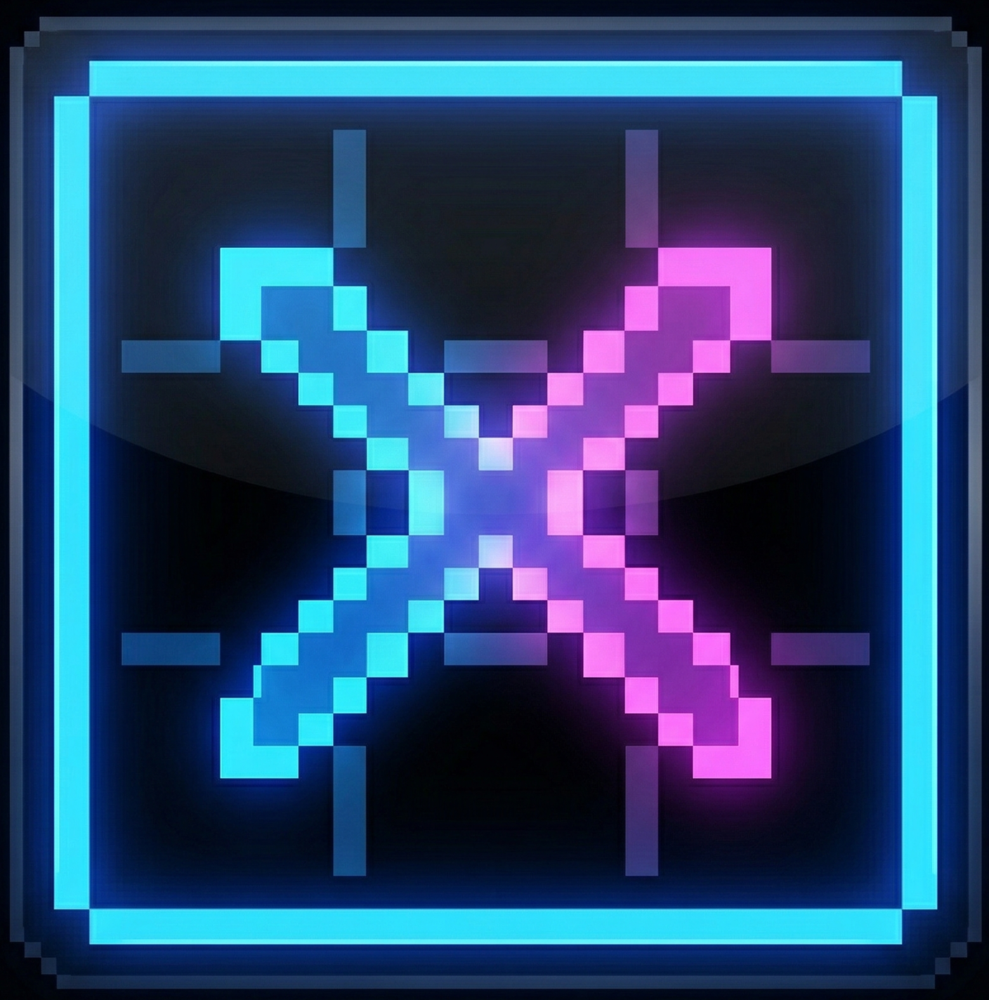

<div align="center">
  
</div>

<h1 align="center">XOGrid</h1>

> Real-time multiplayer Tic-Tac-Toe with AI, friends, and competitive scoring — built with React, Node.js, Socket.IO, and MongoDB.


---

## Features

| Feature | Description |
|---------|-------------|
| Real-time PVP | Challenge friends with WebSocket-powered instant sync |
| AI Opponent | Minimax algorithm with Easy / Medium / Hard difficulty |
| Auth System | Guest, Email/Password, and Google OAuth 2.0 |
| Friends System | Send/accept friend requests, recent players list |
| Stats & Streaks | Win/Loss/Draw tracking with current & best streaks |
| Turn Timer | 30-second countdown with auto-move on expiry |
| Live Chat | In-game messaging with quick taunts (PVP only) |
| Reactions | Send emoji reactions during matches (PVP only) |
| 3D Landing | Interactive Three.js board with physics-based piece drops |
| Midnight Theme | Glassmorphism UI with neon cyan/rose accents |

---

## Project Structure

```
XOGrid/
├── client/                 # React frontend (Vite + Tailwind v4)
│   ├── src/
│   │   ├── components/     # TicTacToe3D, reusable UI
│   │   ├── context/        # AuthContext, SocketContext
│   │   ├── pages/          # Home, Game
│   │   └── services/       # Axios API client
│   ├── vercel.json         # Vercel SPA config
│   └── package.json
│
├── server/                 # Node.js backend (Express + Socket.IO)
│   ├── config/             # MongoDB connection
│   ├── controllers/        # Auth, friends, recent players
│   ├── middleware/          # JWT auth middleware
│   ├── models/             # User, Game schemas
│   ├── routes/             # REST API routes
│   ├── sockets/            # Game socket handlers
│   ├── utils/              # AI (minimax), token generator
│   ├── render.yaml         # Render deploy blueprint
│   └── package.json
│
└── README.md
```

---

## Quick Start (Local)

### Prerequisites
- Node.js 18+
- MongoDB Atlas account (free tier works)
- Google OAuth credentials (optional, for Google login)

### 1. Clone

```bash
git clone https://github.com/anand-mukul/XOGrid.git
cd XOGrid
```

### 2. Setup Server

```bash
cd server
npm install
cp .env.example .env
# Edit .env with your MongoDB URI, JWT secret, etc.
npm run dev
```

### 3. Setup Client

```bash
cd client
npm install
cp .env.example .env
# Edit .env with your API URL
npm run dev
```

### 4. Play

Open `http://localhost:5173` — login as guest, create a game, and play!

---

## Environment Variables

### Server (server/.env)

| Variable | Description | Example |
|----------|-------------|---------|
| `PORT` | Server port | `5000` |
| `MONGODB_URI` | MongoDB connection string | `mongodb+srv://...` |
| `JWT_SECRET` | JWT signing key | `your_secret_key` |
| `CLIENT_URL` | Frontend URL (CORS) | `http://localhost:5173` |
| `GOOGLE_CLIENT_ID` | Google OAuth client ID | `827...apps.googleusercontent.com` |
| `GOOGLE_SECRET_ID` | Google OAuth client secret | `GOCSPX-...` |

### Client (client/.env)

| Variable | Description | Example |
|----------|-------------|---------|
| `VITE_API_URL` | Backend API base URL | `http://localhost:5000/api` |
| `VITE_GOOGLE_CLIENT_ID` | Google OAuth client ID | `827...apps.googleusercontent.com` |

---

## Deployment (Monorepo)

This project is a single repo with `client/` and `server/` directories. Deploy each to its own platform:

### Backend -> Render

1. Go to render.com -> New -> Web Service
2. Connect the XOGrid GitHub repo
3. Settings:
   - Root Directory: `server`
   - Build Command: `npm install`
   - Start Command: `npm start`
   - Runtime: Node
4. Add environment variables (see table above)
5. Set `CLIENT_URL` to your Vercel URL after frontend deploys
6. Deploy — note the URL (e.g. `https://xogrid-api.onrender.com`)

### Frontend -> Vercel

1. Go to vercel.com -> New Project
2. Import the XOGrid GitHub repo
3. Settings:
   - Root Directory: `client`
   - Framework Preset: Vite
   - Build Command: `npm run build`
   - Output Directory: `dist`
4. Add environment variables:
   - `VITE_API_URL` = `https://xogrid-api.onrender.com/api`
   - `VITE_GOOGLE_CLIENT_ID` = your Google client ID
5. Deploy

### Post-Deploy Checklist

- [ ] Set `CLIENT_URL` on Render to your Vercel URL
- [ ] Add Vercel URL to Google OAuth Authorized JavaScript Origins
- [ ] MongoDB Atlas -> Network Access -> Allow `0.0.0.0/0`
- [ ] Visit Vercel URL -> test guest login -> play AI game

---

## API Endpoints

### Auth
| Method | Endpoint | Description |
|--------|----------|-------------|
| `POST` | `/api/auth/guest` | Create guest session |
| `POST` | `/api/auth/signup` | Register with email/password |
| `POST` | `/api/auth/login` | Login with email/password |
| `POST` | `/api/auth/google` | Google OAuth login |
| `GET` | `/api/auth/profile` | Get user profile (protected) |

### Social
| Method | Endpoint | Description |
|--------|----------|-------------|
| `GET` | `/api/auth/friends` | List friends + pending requests |
| `POST` | `/api/auth/friends/request` | Send friend request |
| `POST` | `/api/auth/friends/respond` | Accept/reject request |
| `POST` | `/api/auth/friends/remove` | Remove a friend |
| `GET` | `/api/auth/recent-players` | Recent opponents from game history |

### Socket Events
| Event | Direction | Description |
|-------|-----------|-------------|
| `joinRoom` | Client -> Server | Join/create game room |
| `playMove` | Client -> Server | Place X or O |
| `timerExpired` | Client -> Server | Auto-move when timer hits 0 |
| `rematch` | Client -> Server | Request rematch (swaps symbols) |
| `chatMessage` | Bidirectional | Live chat (PVP only) |
| `sendReaction` | Client -> Server | Send emoji reaction (PVP only) |
| `gameState` | Server -> Client | Full game state update |
| `reaction` | Server -> Client | Broadcast received reaction |

---

## Tech Stack

| Layer | Technology |
|-------|-----------|
| Frontend | React 19, Vite 8, Tailwind CSS v4, Framer Motion, Three.js |
| Backend | Node.js, Express 5, Socket.IO 4 |
| Database | MongoDB Atlas + Mongoose 9 |
| Auth | JWT, bcrypt, Google OAuth 2.0 |
| 3D | React Three Fiber, Drei |
| Deploy | Vercel (frontend), Render (backend) |

---

## License

MIT (c) Anand Mukul
